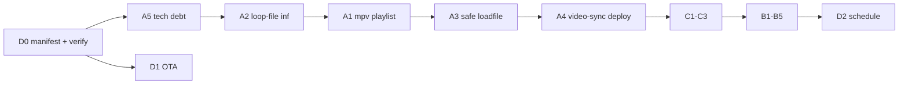

[dsign_4phase_checklist.md](https://github.com/user-attachments/files/29330658/dsign_4phase_checklist.md)
# DSign — План развития: от хорошего плеера к референсному

**Порядок фаз:** A → C → B → D (Playback → Content → API → Ops)  
**Формат задач:** Что меняем → Зачем → Какой результат  
**Связанные документы:** [dsign_test_matrix.md](./dsign_test_matrix.md) — acceptance-тесты playback

> Живой чеклист. При закрытии задачи: `[ ]` → `[x]`, указать PR/коммит в колонке «Где сделано».

---

## Сводка прогресса (обновлять при каждом PR)

| ID | Задача | Статус | Где сделано |
|----|--------|--------|-------------|
| **D0** | Манифест деплоя + verify/apply | ✅ сделано | main, PR #82 |
| **A0** | Сетевой playback / hung / ytdl resilience | ✅ сделано | main, PR #80 |
| **A1** | MPV internal playlist (локальное видео) | ✅ сделано | main, PR #85 |
| **A2** | Single video `loop-file=inf` | ✅ сделано | main, PR #85 |
| **A3** | Safe loadfile + ffprobe | ✅ сделано | main, PR #86 |
| **A4** | `video-sync` Wayland (display-resample) | ✅ сделано | main, PR #87; подтверждено на плеере |
| **A5** | Tech debt | ✅ сделано | PR A5 |
| **C1** | ContentCache | 🟡 в PR | `content_cache.py` |
| **C2** | Audio-only + logo | 🟡 в PR | `logo_management.py`, manual loop |
| **C3** | Nested playlists | ⬜ не начато | — |
| **B1** | Расширить `/api/playback/status` | 🟡 в PR | `get_status()` B1 fields |
| **B2** | `GET /api/health` | 🟡 в PR | `GET /api/health` + aggregates |
| **B3** | `POST /api/playback/override` | ⬜ не начато | — |
| **B4** | API Bearer token | 🟡 частично | `DSIGN_API_TOKEN` для `/api/health` |
| **B5** | Remote control (REST, не WS stub) | ⬜ не начато | WS = `pass` |
| **D1** | `dsign-update` OTA | ⬜ не начато | зависит от **D0** |
| **D2** | Local schedule (SQLite) | ⬜ не начато | после B3 |

**Легенда:** ✅ сделано · 🟡 частично · ⬜ не начато

---

## Рекомендуемый порядок реализации

Продуктовый порядок из плана сохраняем (**A → C → B → D**), но **D0** и **A5** — до масштабных изменений playback и fleet.



| Шаг | PR-фокус | Зачем сейчас |
|-----|----------|--------------|
| 1 | **D0** | Сверка «репо vs плеер» — без этого непонятно, что залито в `/etc`, `/usr`, `/var` |
| 2 | **A5** | Разблокировать чистый Wayland-деплой и `get_status()` |
| 3 | **A2 → A1** | Zero-gap на локальном видео (главная цель фазы A) |
| 4 | **A3 → A4** | Устойчивость к битым файлам + judder на Wayland |
| 5 | **C** | Offline / форматы |
| 6 | **B** | Remote control для пилота интеграторов |
| 7 | **D1 → D2** | OTA и расписание (D1 только поверх D0) |

---

## Деплой: проблема сверки (почему нужен D0)

Сейчас обновление **не равно** «всё из репо на плеере».

| Слой | Путь на плеере | Как обычно обновляют |
|------|----------------|----------------------|
| Python-приложение | `/home/dsign/dsign/` | `git pull` |
| Helper-скрипты | `/usr/local/bin/dsign-*` | вручную `sudo cp` |
| systemd units | `/etc/systemd/system/` | часть из `etc/`, часть **heredoc** в `install_dsign.sh` |
| Конфиги mpv/labwc | `/var/lib/dsign/mpv-minimal/`, `labwc/`, `config/` | частично, часто `if-not-exists` |
| sudoers | `/etc/sudoers.d/` | вручную, не все файлы из репо в install |

**Примеры рассинхрона (проверять при D0):**

- В репо есть `dsign-preview-timer`, `dsign-capture`, `dsign-diagnose-wifi-on-display` — в `install_dsign.sh` не все ставятся.
- `etc/sudoers.d/dsign-screenshot` — в install не попадает.
- `dsign-mpv.service` на устройстве может отличаться от `etc/systemd/system/dsign-mpv.service` (генерация heredoc).

**D0 не заменяет D1 (OTA)** — D0 отвечает на вопрос: *«что на плеере vs что в репо»*. D1 — *«как автоматически применить новую версию»*.

---

## Фаза D0 — Deploy manifest & verify (добавлено к плану)

**Цель:** Одна команда показывает drift; вторая — догоняет систему до репо.

### D0.1. `docs/deploy-manifest.yaml`

- [ ] Каждая запись: `src` (в репо) → `dest` (на системе), `mode` (`always` / `if-missing` / `never`), `post` (`daemon-reload`, `restart unit`)
- [ ] Покрыть: `usr/local/bin/`, `etc/systemd/`, `etc/sudoers.d/`, `etc/dsign/`, `etc/tmpfiles.d/`
- [ ] Пометить файлы, которые сегодня только в heredoc `install_dsign.sh`

### D0.2. `dsign-verify-install`

- [ ] Отчёт: `OK` / `DRIFT` / `MISSING` / `EXTRA_ON_SYSTEM`
- [ ] Режим `--json` для скриптов/monitoring
- [ ] Acceptance: после `git pull` сразу видно, что ещё не залито

### D0.3. `dsign-apply-install`

- [ ] Идемпотентный apply по манифесту (`--only drifted`)
- [ ] `install_dsign.sh` → bootstrap (user, venv, nginx) + вызов apply

**Cursor prompt (D0):**
> Add docs/deploy-manifest.yaml mapping repo paths to system paths. Implement usr/local/bin/dsign-verify-install and dsign-apply-install. Refactor install_dsign.sh to use manifest instead of duplicating heredoc units where etc/systemd files exist.

---

## A0 — Сетевой playback (вне исходного A1–A5, уже в main)

Закрывает инциденты Rutube/VK (hung, 52 мин на logo). **Не заменяет** A1–A2 (zero-gap локали).

| Пункт | Статус | Примечание |
|-------|--------|------------|
| Mid-stream reload / stagnation / proactive refresh | ✅ | `playlist_management.py` |
| `dsign-mpv-recover` — правильный Wayland unit | ✅ | PR #80 |
| Progressive ytdl open timeout (90s / 45s) | ✅ | |
| Abort после N consecutive open failures | ✅ | default N=3 |
| Resume **last-good** после hung | ✅ | `get_resume_start_index_for_hung_recovery()` |
| Full-cycle all-network-fail → last-good или logo+cooldown | ✅ | |
| `network_health` в status / health_check | ✅ | частичный B1/B2 |

**Acceptance (полевой):** после hung recovery — не полный обход плейлиста по 3 мин/ролик; `consecutive_ytdl_failures` в API.

---

## Фаза A — «Ноль чёрных кадров» (Playback Engine)

**Цель:** Плеер не показывает чёрный экран. Любой контент → любой контент без gap.

**Ветвление в `play()` (целевая архитектура):**

```
all local video?     → A1 play_local_video_playlist()
exactly 1 local?     → A2 loop-file=inf
mixed / network / images → _manual_slideshow_loop() (как сейчас)
```

---

### A1. Local Video Playlist → MPV Internal Playlist

**Статус:** ⬜ не начато

**Что меняем:**
- В `PlaylistManager.play()` — ветка `play_local_video_playlist()` если все items — локальные видео.
- M3U/FFconcat + один `loadfile`.
- `prefetch-playlist=yes` в mpv.conf.

**Зачем:** Сейчас каждый переход = `loadfile replace` = 50–500 ms чёрный кадр. MPV internal playlist = switch buffer ≈ 0 ms.

**Логика:**
```
Плеер видит: [video1.mp4, video2.mp4, video3.mp4]
Вместо: loadfile v1 → EOF → loadfile v2 → EOF → …
Делаем: loadfile playlist.m3u → MPV предзагружает следующий
Мониторим: playlist-pos
```

**Результат:** Video→video zero gap; ниже CPU; стабильнее memory.

**Acceptance:**
- [ ] 10 циклов [A, B] — 10/10 zero gap
- [ ] `journalctl` — 1 `loadfile` на весь плейлист

**Cursor prompt:**
> Branch PlaylistManager.play() for all-local-video playlists: temp M3U, single loadfile, monitor playlist-pos, prefetch-playlist=yes. Keep manual loop for mixed/network/images.

---

### A2. Single Video → loop-file=inf

**Статус:** ✅ сделано (PR #85)

---

### A3. Safe Loadfile — валидация перед playback

**Статус:** ✅ сделано (main, PR #86)

**Что меняем:** `_safe_loadfile(path)`:
1. `os.path.exists()`
2. `ffprobe -v error` (паттерн есть в `file_service.py`)
3. `loadfile`
4. wait `vo-configured=true` (max 5 s)
5. fail → skip, logo, next item

**Acceptance:**
- [ ] Плейлист [valid, corrupt, valid] — skip corrupt, без restart плеера

---

### A4. video-sync в Wayland-профиле

**Статус:** ✅ сделано (main, PR #87) — `video-sync=display-resample`; на плеере подтверждено 26.06

**Зачем:** `audio` убирал judder, но на сетевом HLS видео «ползло» за аудио-часами при буферизации. `display-vdrop` давал микростаттер на labwc. `display-resample` — компромисс для 29.97 fps @ 60 Hz.

**Acceptance:**
- [ ] Rutube/HLS — нормальная скорость, без slow-mo
- [ ] 29.97 fps @ 60 Hz — приемлемый judder (лучше vdrop)
- [ ] Файл на устройстве: `/var/lib/dsign/mpv-minimal/profiles/intel-iris-xe-balanced-wayland.conf` (D0 apply, mode `always`)

---

### A5. Tech Debt (быстрые фиксы)

**Статус:** ✅ сделано

| Пункт | Статус |
|-------|--------|
| `wayland_manger.py` → `wayland_manager.py` | ✅ |
| `restart_mpv()` dead code в `playlist_management.py` | ✅ удалён |
| `_log_debug` в `playback_service.get_status()` | ✅ метод добавлен |

**Acceptance:**
- [x] `python -c "from dsign.services.playback_service import PlaybackService"` на чистом venv
- [x] `GET /api/playback/status` без exception

---

## Фаза C — Content Resilience (Offline + Formats)

**Цель:** Плеер выживает без интернета. Больше форматов.

| ID | Задача | Статус | Зависимости |
|----|--------|--------|-------------|
| C1 | ContentCache (`content_cache.py`) | 🟡 в PR | A3, network path |
| C2 | Audio-only + logo (imv) | ⬜ | — |
| C3 | Nested playlists (DB) | ⬜ | миграция модели |

### C1. ContentCache

**Статус:** 🟡 в PR — prefetch следующего `ext-*` на диск; offline / `PLAY_WHEN_READY` → local `loadfile`

**Env (плеер):**
- `DSIGN_CONTENT_CACHE_ENABLED=1` (default on)
- `DSIGN_CONTENT_CACHE_DIR` — default `{MEDIA_ROOT}/cache`
- `DSIGN_CONTENT_CACHE_PREFETCH=1` — фоновая загрузка следующего ролика
- `DSIGN_CONTENT_CACHE_PLAY_WHEN_READY=1` — играть с диска, если файл готов
- `DSIGN_CONTENT_CACHE_MAX_GB=8` — лимит, LRU eviction

**Acceptance:**
- [ ] [net1, net2, net3] — net2 предзагружен до EOF net1
- [ ] Offline — играет из кэша, не чёрный экран
- [ ] `/api/playback/status` → `cache_state`

### C2. Audio-Only + Logo

**Статус:** 🟡 в PR — локальный audio (mp3/wav/…) + logo: Wayland `vo=null` + imv; DRM `external-file` logo

**Acceptance:**
- [ ] [video.mp4, audio.mp3, video2.mp4] — audio с logo
- [x] Upload allowlist: mp3, wav, ogg, flac, m4a, aac, opus

### C3. Nested Playlists

**Acceptance:**
- [ ] Nested playlist раскрывается в flat list при play

---

## Фаза B — API для управления (Remote Control)

**Цель:** Облако/скрипт полностью управляет плеером.

| ID | Статус | Что осталось |
|----|--------|--------------|
| B1 | 🟡 в PR | `item_index`, `item_count`, `media_key`, `time_pos`, `duration`, `is_network`, `mpv_responsive`, `cache_state` |
| B2 | 🟡 в PR | `GET /api/health`: playback + system/display/network/services aggregates |
| B3 | ⬜ | Emergency override + return_to_previous |
| B4 | 🟡 частично | `DSIGN_API_TOKEN` Bearer для `/api/health` |
| B5 | ⬜ | **REST** seek/pause/skip (рекомендация: не чинить WS stub) |

### B1 — целевой ответ `/api/playback/status`

```json
{
  "status": "playing",
  "playlist_id": 42,
  "item_index": 3,
  "item_count": 10,
  "media_key": "promo_v2.mp4",
  "time_pos": 12.5,
  "duration": 30.0,
  "is_network": false,
  "mpv_responsive": true,
  "network_health": { "consecutive_ytdl_failures": 0, "cdn_may_be_down": false },
  "cache_state": { "cached_items": 2, "cache_size_mb": 150 }
}
```

---

## Фаза D — Ops (Эксплуатация)

**Цель:** Fleet без ручного вмешательства.

### D1. dsign-update (Self-Update)

**Статус:** ⬜ · **Требует D0**

- [ ] `check` / `download` / `apply` / `rollback`
- [ ] systemd timer (например 03:00)
- [ ] apply вызывает `dsign-apply-install`, не только `git pull`

**Acceptance:**
- [ ] Update downtime < 5 мин; rollback < 2 мин; fail не ломает систему

### D2. Local Schedule (SQLite)

**Статус:** ⬜ · после B3 (приоритеты override vs schedule)

**Acceptance:**
- [ ] Правило 09:00 → playlist A (±30 s)
- [ ] Offline 24 ч — расписание работает

---

## Итоговая таблица фаз

| Фаза | Задачи | Результат |
|------|--------|-----------|
| **D0** | manifest, verify, apply | Понятно, что на плеере и что залить |
| **A0** | network resilience | ✅ Rutube/VK hung, fast-fail (main) |
| **A** | A1–A5 | Zero-gap локали, safe loadfile |
| **C** | C1–C3 | Offline, audio-only, nested |
| **B** | B1–B5 | Remote control + monitoring |
| **D** | D1–D2 | OTA + автономное расписание |

---

## Коммерция (кратко)

4 фазы = **технический foundation**, не продукт продаж.

| Даёт foundation | Не заменяет |
|-----------------|-------------|
| Zero-gap, safe loadfile, health API | Fleet dashboard |
| OTA, schedule | Cloud SaaS, billing |
| Override API | Analytics, SLA |

**Стратегия:** A + D0 + B1/B2 → пилот интеграторам → Fleet Dashboard поверх foundation.

**Риск:** Dashboard до фикса playback = «красивый UI для глючного плеера».

---

## Журнал изменений этого документа

| Дата | Изменение |
|------|-----------|
| 2026-06-17 | Добавлены: сводка прогресса, D0, A0 (PR #80), порядок реализации, деплой/drift, чекбоксы acceptance |
| 2026-06-30 | B2 — `GET /api/health` (playback + system/display/network/services) |
| 2026-06-29 | C2 + B1 — audio+logo (imv), расширенный `/api/playback/status` |
