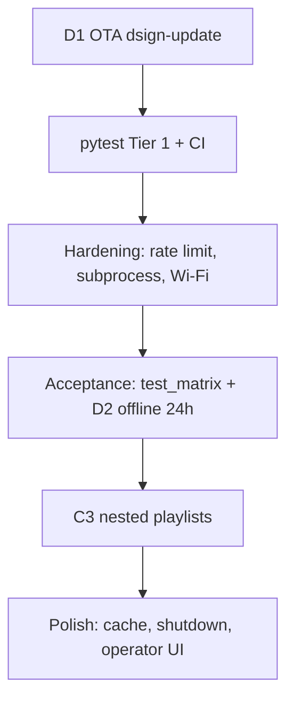

# DSign — сводный backlog (что осталось)

**Версия:** 2026-07-08  
**Назначение:** единая точка входа — **только открытые задачи**. Закрыли пункт → `[x]` здесь и в исходном документе (колонка «Источник»).

**Не дублирует:** выполненные фазы, спеки API, детальные prompt’ы — см. ссылки ниже.

---

## Исходные документы

| Документ | Роль | Когда открывать |
|----------|------|-----------------|
| [dsign_4phase_checklist.md](./dsign_4phase_checklist.md) | Фазы A→C→B→D, продуктовый roadmap | Контекст фазы, acceptance, Cursor prompt |
| [dsign_schedule_spec.md](./dsign_schedule_spec.md) | Спека расписания D2 (v1.5) | API, модель, UI расписания |
| [dsign_test_matrix.md](./dsign_test_matrix.md) | Ручные playback-тесты на плеере | Полевые проверки zero-gap, boot, network |
| [dsign_improvement_checklist.md](./dsign_improvement_checklist.md) | Production hardening (тесты, SRE) | Детали pytest, rate limit, subprocess |
| **Этот файл** | **Сводный backlog** | **С чего начать сегодня** |

---

## Уже сделано (не повторять)

Краткая сводка — детали в [4phase](./dsign_4phase_checklist.md).

| Область | Статус |
|---------|--------|
| D0 manifest + verify/apply | ✅ PR #82 |
| A0 network resilience | ✅ PR #80 |
| A1–A4 playback (код) | ✅ PR #85–#87 |
| A5 tech debt | ✅ |
| C1 ContentCache, C2 audio+logo | ✅ |
| B1–B5 API + Bearer playback | ✅ |
| **D2 расписание D2.1–D2.5** | ✅ PR #103–#107 |
| `GET /api/health`, upload limit 1 GiB, login rate limit | ✅ в коде |
| `MPVManager.shutdown()`, SIGTERM → `ScheduleEngine.stop()` | ✅ частично |

> **Расхождения в 4phase:** сводка помечает D0/A1 ✅, но в теле документа остались старые `[ ]` — ориентируйтесь на сводку + код. Секцию D0/A1 в 4phase стоит синхронизировать отдельным PR.

---

## Рекомендуемый порядок работ



| Шаг | Фокус | Зачем сейчас |
|-----|-------|--------------|
| 1 | **D1 OTA** | Fleet без ручного `git pull`; зависит от D0 (уже есть) |
| 2 | **pytest Tier 1 + GitHub Actions** | Gate на regression до массового рефакторинга |
| 3 | **API hardening** | rate limit, subprocess timeouts, Wi-Fi validation |
| 4 | **Acceptance** | test_matrix + offline 24 ч расписания |
| 5 | **C3** | nested playlists — единственная открытая фаза C |
| 6 | **Polish** | graceful shutdown playback, cache retry, operator UI |

---

## Сводная таблица открытых задач

| ID | Задача | 🔴🟡🟢 | Источник | Зависимости |
|----|--------|--------|----------|-------------|
| **D1** | `dsign-update` OTA (check/download/apply/rollback + timer) | 🔴 | 4phase §D1 | D0 |
| **T-CI** | GitHub Actions: `pytest` на PR | 🔴 | improvement §1 | — |
| **T-IPC** | Unit: `MpvJsonIpcSession` | 🔴 | improvement §1.1 | — |
| **T-MPV** | Unit: `MPVManager._send_command()` | 🔴 | improvement §1.2 | T-IPC |
| **T-REC** | Integration: recovery flows | 🔴 | improvement §1.3 | T-IPC, T-MPV |
| **T-EOF** | Integration: EOF detection (6 путей) | 🔴 | improvement §1.4 | T-IPC, T-MPV |
| **T-API** | API smoke (auth, Bearer, schedule, CSRF→**400**) | 🔴 | improvement §1.5 | — |
| **T-SCH** | Unit/integration: `schedule_service`, exceptions, monthly | 🔴 | schedule §10, 4phase D2 | — |
| **T-AUD** | Integration: audio subsystem | 🔴 | improvement §1.6 | T-IPC |
| **H-RL** | Rate limiting API (play/stop/screenshot/reboot) | 🔴 | improvement §2 | — |
| **H-SUB** | Subprocess timeout audit (`amixer` и др.) | 🔴 | improvement §3 | — |
| **H-WIFI** | SSID/password validation (1–32, WPA 8–63) | 🔴 | improvement §5 | — |
| **H-UPL** | Upload: disk check до save, streaming >100MB | 🟡 | improvement §4 | частично ✅ 1 GiB |
| **D2-OPS** | `DSIGN_API_TOKEN` на fleet + проверка schedule Bearer | 🟡 | 4phase D2, schedule §D2.5 | — |
| **D2-24H** | Offline 24 ч — расписание по timezone | 🟡 | schedule §D2.4, 4phase D2 | — |
| **C3** | Nested playlists (DB + flat play) | 🟡 | 4phase §C3 | — |
| **H-SD** | Graceful shutdown playback (join thread, logo, DB) | 🟡 | improvement §6 | частично ✅ |
| **H-MEM** | `_media_backoff` TTL cleanup | 🟡 | improvement §7 | — |
| **H-PREF** | ContentCache: thread pool + cancel on playlist change | 🟡 | improvement §8 | — |
| **H-CACHE** | ContentCache download retry (exp backoff) | 🟡 | improvement §9 | — |
| **H-REF** | Refactor длинных методов (после тестов) | 🟡 | improvement §10 | T-* |
| **H-RQ** | Recovery queue вместо `blocking=False` skip | 🟡 | improvement §11 | — |
| **H-COAL** | Adaptive `DSIGN_MPV_RESTART_COALESCE_SEC` | 🟡 | improvement §12 | — |
| **P-DOC** | `docs/ENVIRONMENT.md` (env vars) | 🟢 | improvement §13 | — |
| **P-TYP** | mypy strict на critical paths | 🟢 | improvement §14 | — |
| **P-CFG** | Расширить `Config`, убрать дубли `os.getenv` | 🟢 | improvement §15 | частично ✅ |
| **P-UI** | Operator dashboard (HTML над `/api/health`) | 🟢 | improvement §17 | частично ✅ health API |
| **P-ALERT** | Webhook/email alerting | 🟢 | improvement §18 | P-UI |

---

## P0 — Продукт и блокеры production

### D1 — `dsign-update` OTA

- [ ] `check` / `download` / `apply` / `rollback`
- [ ] systemd timer (например 03:00)
- [ ] `apply` вызывает `dsign-apply-install`, не только `git pull`
- [ ] Acceptance: downtime < 5 мин; rollback < 2 мин; fail не ломает систему

*Источник:* [4phase §D1](./dsign_4phase_checklist.md)

### T-CI — Continuous Integration

- [ ] Каталог `tests/` + `pytest` / `pytest-cov` (зависимости уже в `setup.py`)
- [ ] GitHub Actions workflow на PR: unit → integration (fake MPV) → API smoke
- [ ] Merge gate: Tier 1 must pass

*Источник:* improvement §1, стратегия тестов

### T-IPC … T-AUD — pytest Tier 1

Детальный список кейсов — в [dsign_improvement_checklist.md](./dsign_improvement_checklist.md) §1.1–1.6.

**Добавить к improvement (нет в оригинале):**

- [ ] `schedule_service`: `_monthly_matches`, exceptions, `expand_week` / `expand_month`
- [ ] API: `POST/DELETE /api/schedule/exceptions`, `GET /api/schedule/month`
- [ ] Bearer: schedule endpoints с `DSIGN_API_TOKEN` (без CSRF)

**Поправки ожиданий:**

- CSRF на `/api/*` → **400**, не 403 (`api_token_auth.py`)
- Тест rate limit play/stop → после **H-RL**, не до

### H-RL — Rate limiting API

- [ ] Flask-Limiter (или аналог) на mutating endpoints
- [ ] `POST /api/playback/play` — 5/min; `stop` — 10/min
- [ ] `POST /api/media/mpv_screenshot/capture` — 6/min
- [ ] `POST /api/system/services/*/restart` — 3/min (admin)
- [ ] `POST /api/system/reboot` — 1/hour (admin)
- [ ] Глобально: 100 req/min per IP

*Сейчас:* rate limit только на **login** (`auth_routes.py`).

*Источник:* improvement §2

### H-SUB — Subprocess timeouts

- [ ] `_audio_set()` → `amixer` с `timeout=3`
- [ ] Audit остальных `subprocess.run` без timeout (`settings_service`, `api_routes` display apply, …)
- [ ] `_run_nmcli` уже 20–45s — ок

*Источник:* improvement §3

### H-WIFI — Wi-Fi validation

- [ ] SSID: 1–32 символа, без control chars
- [ ] WPA password: 8–63 (если задан)
- [ ] Reject empty (уже есть) — расширить валидацию

*Сейчас:* только `strip()` + not empty (`connect_wifi_network`).

*Источник:* improvement §5

---

## P1 — Acceptance и функциональные хвосты

### D2 — расписание (ops + тест)

- [ ] **D2-24H:** отключить NTP 24 ч, слоты срабатывают по `settings.timezone`
- [ ] **D2-OPS:** на fleet задать `DSIGN_API_TOKEN`; curl Bearer на `/api/schedule/rules`

*Источник:* [schedule §D2.4–D2.5](./dsign_schedule_spec.md), [4phase §D2](./dsign_4phase_checklist.md)

### C3 — Nested playlists

- [ ] Модель / миграция nested playlist
- [ ] При play — раскрытие в flat list

*Источник:* [4phase §C3](./dsign_4phase_checklist.md)

### Ручные acceptance (плеер)

Не автоматизировать вместо pytest — прогон по [dsign_test_matrix.md](./dsign_test_matrix.md). Открытые из 4phase:

- [ ] **A3:** плейлист [valid, corrupt, valid] — skip corrupt
- [ ] **A4:** Rutube/HLS скорость; judder 29.97@60Hz
- [ ] **A1/A2:** 10/10 zero gap local video (VID-VID-001 в test_matrix)
- [ ] **C1:** prefetch net2 до EOF net1

---

## P2 — Hardening и polish (после P0)

### H-UPL — Upload (дополнить существующее)

**Уже есть:** `MAX_CONTENT_LENGTH` 1 GiB, post-save size check.

- [ ] Disk space check **до** сохранения файла
- [ ] Streaming upload для больших файлов (опционально снизить лимит на Pi)

*Источник:* improvement §4

### H-SD — Graceful shutdown

**Уже есть:** `MPVManager.shutdown()`, `MpvJsonIpcSession.close()`, SIGTERM → schedule engine stop.

- [ ] SIGTERM/SIGINT: `_stop_event` → join playback thread
- [ ] Idle logo перед exit; DB/session cleanup

*Источник:* improvement §6

### H-MEM, H-PREF, H-CACHE, H-RQ, H-COAL

См. [improvement §7–12](./dsign_improvement_checklist.md) — без дублирования текста.

### P-DOC … P-ALERT — Nice to have

- [ ] `docs/ENVIRONMENT.md`
- [ ] mypy `--strict` в CI
- [ ] Централизовать env в `Config` (расширить `dsign/config/config.py`)
- [ ] Operator UI поверх `GET /api/health` + `/api/playback/status`
- [ ] Alerting webhooks

---

## Быстрый старт для агента / разработчика

```
1. Открыть этот файл (dsign_backlog.md)
2. Выбрать ID из таблицы (например D1 или T-IPC)
3. Детали → исходный документ по колонке «Источник»
4. Закрыли → [x] здесь + в источнике + PR в колонке коммита
```

**Следующий логичный PR по продукту:** **D1 OTA**  
**Следующий PR по качеству:** **T-CI + T-IPC** (фундамент для всего improvement)

---

## Журнал backlog

| Дата | Изменение |
|------|-----------|
| 2026-07-08 | Создан сводный backlog из 4phase + schedule_spec + improvement_checklist |
